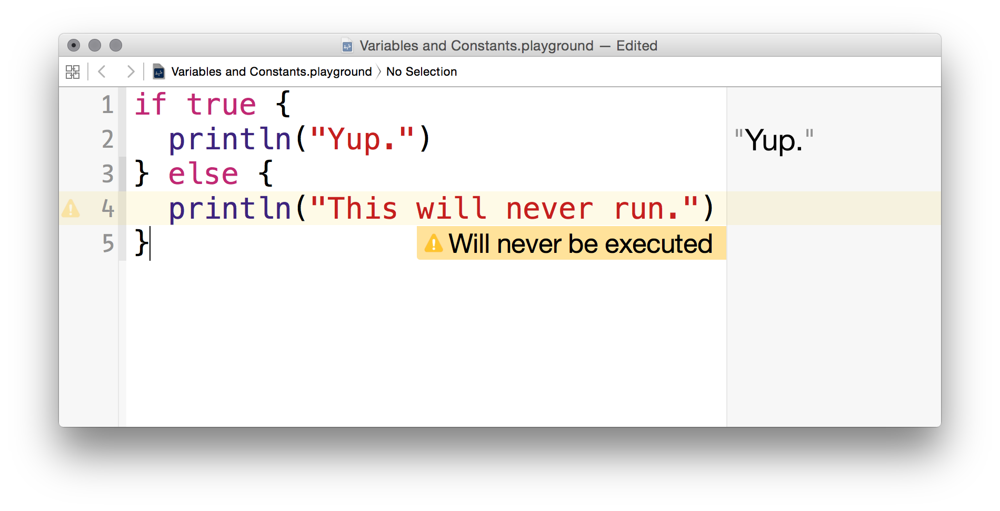

# Conditionals

Swift supports conditionals and they're a lot like what you're used to from other languages.



At first glance, this looks a lot like JavaScript, but the eagle-eyed observer will notice that we don't need to put parenthesis around the condition. If you look at the screenshot above, you'll probably also see that the compiler picked up on a code path that will never be executed and warned us about. This is one of the perks of using a compiled language.

We can also compare values in our conditionals.

```swift
if 2 < 4 {
  println("Math works!")
}

let firstString = "hello"
let secondString = "hello"

if firstString == secondString {
  println("These strings are the same.")
}

if 6 != 9 {
  println("We can check for inequality as well.")
}
```

Rounding back to our discussion on strings. If we import the Foundation framework, we can see if one string contains another.

```swift
import Foundation

let organization = "Girl Develop It"

if organization.rangeOfString("Develop") != nil {
  println("This string contains the word \"Develop\".")
} else {
  println("It doesn't contain our word.")
}
```
